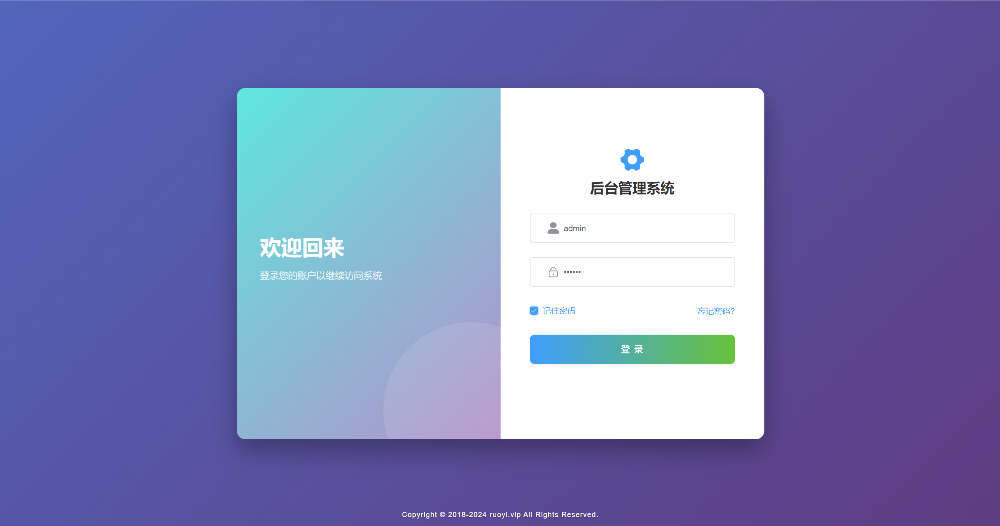
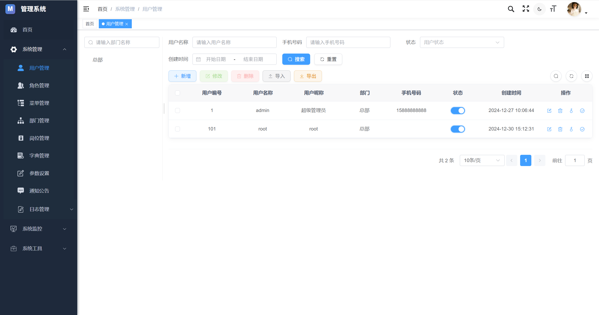
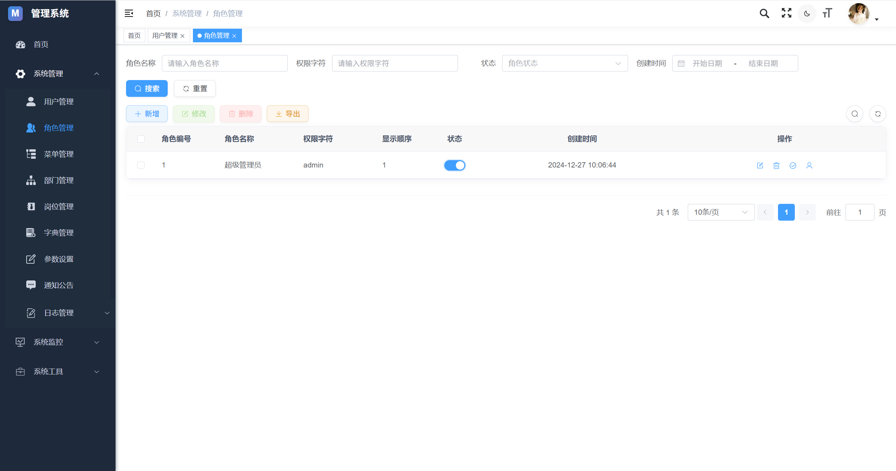
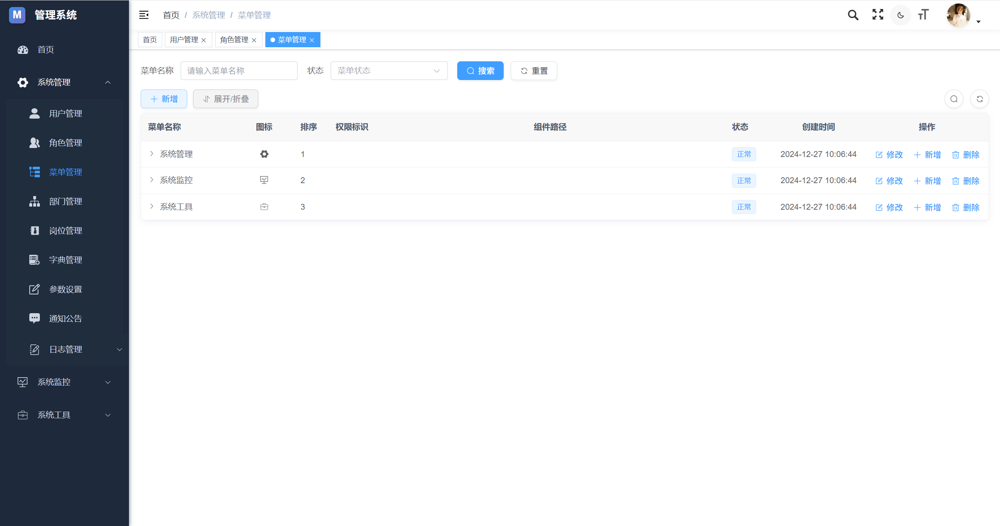
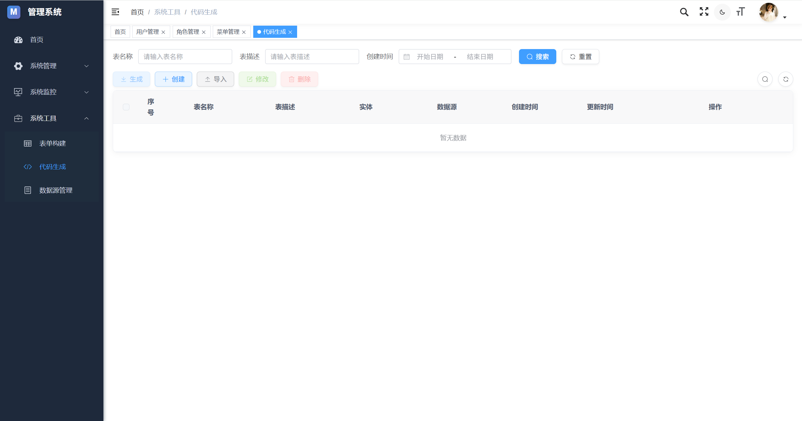
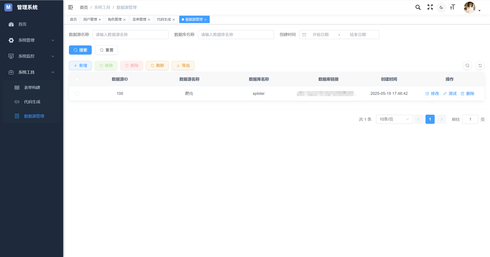

# RuoYi Magic Vue

## 项目介绍

本项目是基于 RuoYi 的二次开发项目，集成了多项增强功能和技术升级。RuoYi Magic Vue 在保留原有 RuoYi 优秀特性的基础上，进行了技术栈更新和功能扩展，旨在提供更现代化、更易用的前端管理系统框架。

## 技术栈

- 核心框架：Vue 3.x
- 构建工具：Vite
- UI 框架：Element Plus
- 状态管理：Pinia
- 路由管理：Vue Router
- HTTP 客户端：Axios
- CSS 预处理：Sass/SCSS

## 主要特性

- 🚀 **技术升级**：从 Vue 2 升级到 Vue 3，从 Webpack 升级到 Vite，构建速度更快
- 🔑 **权限管理**：完善的用户、角色、权限管理体系
- 🎨 **主题定制**：支持多种主题模式，包括明暗主题切换
- 📱 **响应式设计**：适配不同尺寸的屏幕和设备
- 📊 **丰富组件**：内置丰富的组件和常用功能模块
- 🔌 **插件体系**：可扩展的插件体系，轻松集成第三方功能
- 🛠️ **代码生成**：强大的代码生成器，提高开发效率
- 🌐 **国际化**：支持多语言切换

## 增强功能

- 优化的用户体验和界面交互
- 更完善的错误处理和日志记录
- 更安全的认证和授权机制
- 更高效的前端构建和部署流程
- 更现代化的代码组织和模块化结构

## 快速开始

### 环境准备

- Node.js >= 16.0.0
- npm >= 7.0.0

### 安装依赖

```bash
npm install
```

### 开发模式

```bash
npm run dev
```

### 构建生产版本

```bash
npm run build:prod
```
## 系统截图

### 登录页面



### 用户管理



### 角色管理



### 菜单管理



### 代码生成



### 数据源管理




## 文档

详细文档请参考 [RuoYi 官方文档](http://doc.ruoyi.vip/)

## 贡献

欢迎提交问题和功能需求，也欢迎提交 Pull Request。

## 许可证

[MIT](LICENSE)

## 鸣谢

- [RuoYi](http://ruoyi.vip/) - 感谢 RuoYi 提供的优秀开源项目
- [Vue](https://vuejs.org/)
- [Element Plus](https://element-plus.org/)
- [Vite](https://vitejs.dev/)